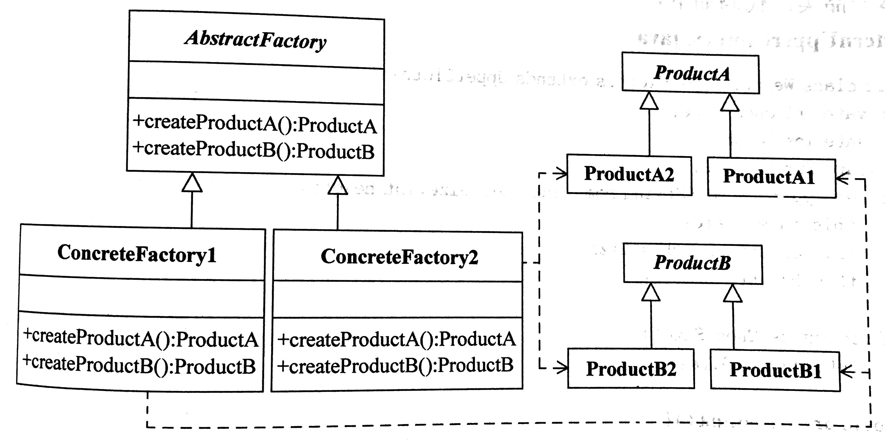

# 抽象工厂模式（Abstract Factory）

## 定义

提供一个创建一系列或相互依赖对象的接口，而无需指定它们具体的类。

## 角色

- 抽象产品(Product) 抽象类或接口

- 具体产品(Concrete Product)

- 抽象工厂(Abstract Factory)

- 具体工厂(Concrete Factory)

## 优点

1. 抽象工厂模式隔离了具体类的生成，使得客户并不需要知道什么被创建。由于这种隔离，更换一个具体工厂就变得相对容易。所有的具体工厂都实现了抽象工厂中定义的那些公共接口，因此只需改变具体工厂的实例，就可以在某种程度上改变整个软件系统的行为。另外，应用抽象工厂模式可以实现高内聚低耦合的设计目的，因此抽象工厂模式得到了广泛的应用。

2. 当一个产品族中的多个对象被设计成一起工作时，它能够保证客户端始终只使用同一个产品族中的对象。 这对一些需要根据当前环境来决定其行为的软件系统来说，是一种非常实用的设计模式。

3. 增加新的具体工厂和产品族很方便，无须修改已有系统，符合“开闭原则”。

## 适用环境

- 一个系统不应当依赖于产品类实例如何被创建、组合和表达的细节，这对 于所有类型的工厂模式都是重要的。

- 系统中有多于一个的产品族，而每次只使用其中某一产品族。

- 属于同一个产品族的产品将在一起使用，这一约束必须在系统的设计中体 现出来。

- 系统提供一个产品类的库，所有的产品以同样的接口出现，从而使客户端 不依赖于具体实现。

## UML

## 参考

关于几个工厂模式的区别：[抽象工厂模式和工厂模式的区别？ - 知乎](https://www.zhihu.com/question/20367734)