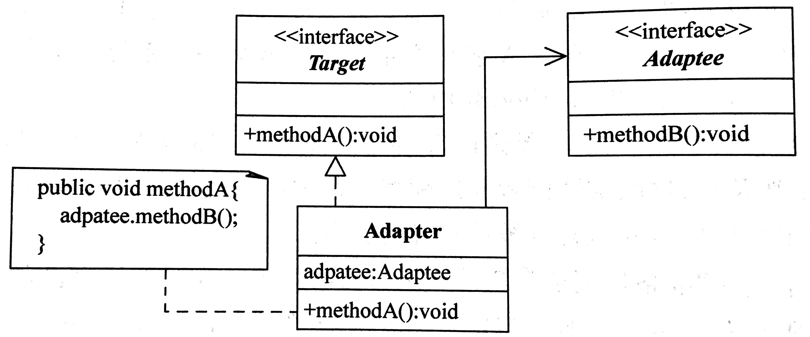

# 适配器模式

## 定义

将一个类的接口转换成客户希望的另外一个接口。Adapter模式使得原本由于接口不兼容而不能一起工作的那些类可以一起工作。

## 角色

- 目标(Target) 接口

- 被适配者(Adaptee)

- 适配器(Adapter)

## 优点

1. 将目标类和适配者类解耦，通过引入一个适配器类来重用现有的适配者类，而无须修改 原有代码。

2. 增加了类的透明性和复用性，将具体的实现封装在适配者类中，对于客户端类来说是透 明的，而且提高了适配者的复用性。

3. 灵活性和扩展性都非常好，通过使用配置文件，可以很方便地更换适配器，也可以在不 修改原有代码的基础上增加新的适配器类，完全符合“开闭原则”。

类适配器模式还具有如下优点：

1. 由于适配器类是适配者类的子类，因此可以在适配器类中置换一些适配者的方法，使得 适配器的灵活性更强。

对象适配器模式还具有如下优点：

- 一个对象适配器可以把多个不同的适配者适配到同一个目标， 也就是说，同一个适配器可以把适配者类和它的子类都适配到目标接口。

## 适用环境

- 系统需要使用现有的类，而这些类的接口不符合系统的需要。

- 想要建立一个可以重复使用的类，用于与一些彼此之间没有太大关联的一 些类，包括一些可能在将来引进的类一起工作。

## UML

## Example

为了玩一些老游戏，你购买了一台二手日版 NDS，不过日版机器工作电压是 110V，于是使用变压器将国内 220V 电压转化为 110V。