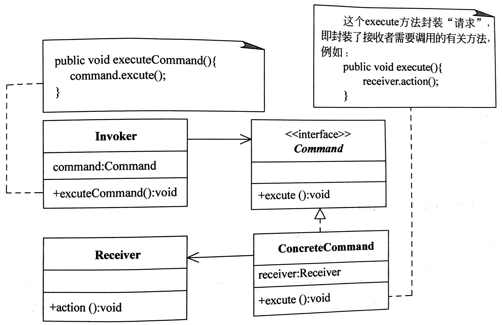

# 命令模式

## 定义
将一个请求封装为一个对象，从而使用户可用不同的请求对客户进行参数化了；对请求排队或记录请求日志，以及支持可撤销的操作。

## 角色
接收者(Receiver)
命令(Command)
具体命令(Concrete Command)
请求者(Invoker)

## 优点
降低系统的耦合度。
新的命令可以很容易地加入到系统中。
可以比较容易地设计一个命令队列和宏命令（组合命 令）。
可以方便地实现对请求的Undo和Redo。

## 适用环境
系统需要将请求调用者和请求接收者解耦，使得调用者和接收者不直接交互。
系统需要在不同的时间指定请求、将请求排队和执行请求。
系统需要支持命令的撤销(Undo)操作和恢复(Redo)操作。
系统需要将一组操作组合在一起，即支持宏命令。

## UML
