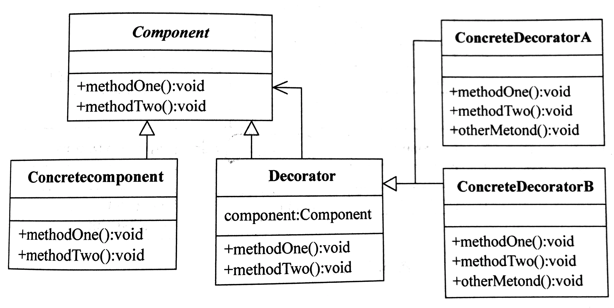

# 装饰模式

## 定义

动态地给对象添加一些额外的职责。就功能来说装饰模式相比生成子类更为灵活。

## 角色

- 抽象组件(Component)

- 具体组件(Concrete Component)

- 装饰(Decoration)

- 具体装饰(Concrete Decoration)

## 优点

- 装饰模式与继承关系的目的都是要扩展对象的功能，但是装饰模式可以提供比继 承更多的灵活性。

- 可以通过一种动态的方式来扩展一个对象的功能，通过配置文件可以在运行时选择不同的装饰器，从而实现不同的行为。

- 通过使用不同的具体装饰类以及这些装饰类的排列组合，可以创造出很多不同行为的组合。可以使用多个具体装饰类来装饰同一对象，得到功能更为强大的对象。

- 具体构件类与具体装饰类可以独立变化，用户可以根据需要增加新的具体构件类和具体装饰类， 在使用时再对其进行组合，原有代码无须改变， 符合“开闭原则”。

## 适用环境

- 在不影响其他对象的情况下，以动态、透明的方式给单个对象添加职责。

- 需要动态地给一个对象增加功能，这些功能也可以动态地被撤销。

- 当不能采用继承的方式对系统进行扩充或者采用继承不利于系统扩展和维护时。不能采用继承的情况主要有两类： 第一类是系统中存在大量独立的扩展，为支持每一种组合 将产生大量的子类，使得子类数目呈爆炸性增长；第二类 是因为类定义不能继承（如final类）。

## UML

