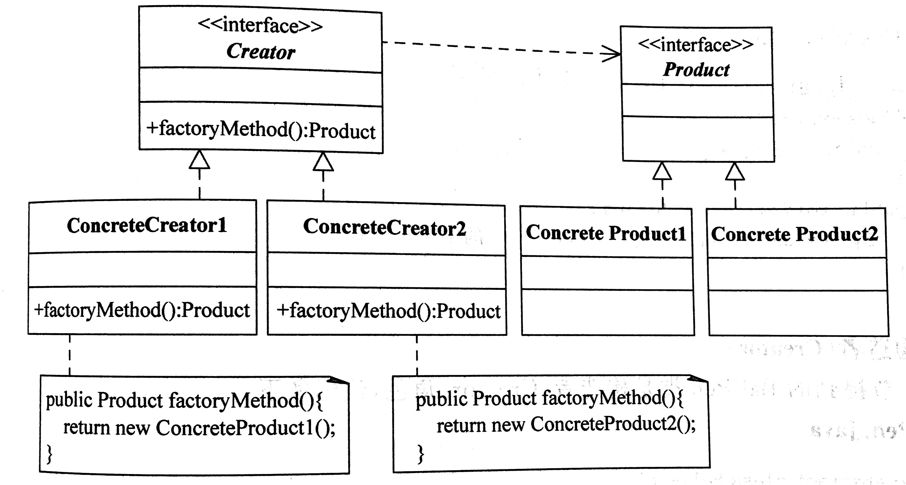

# 工厂方法模式（Factory Method Pattern）

## 定义

定义一个用于创建对象的接口，让子类决定实例化哪一个类。Factory Method使一个类的实例化延迟到其子类。

## 角色

抽象产品(Product) 抽象类或接口

具体产品(Concrete Product)

构造者(Creator)

具体构造者(Concrete Creator)

##优点

在工厂方法模式中，工厂方法用来创建客户 所需要的产品，同时还向客户隐藏了哪种具 体产品类将被实例化这一细节，用户只需要关心所需产品对应的工厂，无须关心创建细节，甚至无须知道具体产品类的类名。

基于工厂角色和产品角色的多态性设计是工 厂方法模式的关键。 它能够使工厂可以自主确定创建何种产品对象， 而如何创建这个对象的细节则完全封装在具体工厂内部。 工厂 方法模式之所以又被称为多态工厂模式， 是 因为所有的具体工厂类都具有同一抽象父类。

使用工厂方法模式的另一个优点是在系统中 加入新产品时， 无须修改抽象工厂和抽象产 品提供的接口， 无须修改客户端， 也无须修 改其他的具体工厂和具体产品， 而只要添加 一个具体工厂和具体产品就可以了。 这样， 系统的可扩展性也就变得非常好， 完全符合 “开闭原则”。

## 适用环境

一个类不知道它所需要的对象的类：在工厂方法模式中，客户端不需要知 道具体产品类的类名，只需要知道所对应的工厂即可，具体的产品对象由 具体工厂类创建；客户端需要知道创建具体产品的工厂类。

一个类通过其子类来指定创建哪个对象：在工厂方法模式中，对于抽象工 厂类只需要提供一个创建产品的接口，而由其子类来确定具体要创建的对 象，利用面向对象的多态性和里氏代换原则，在程序运行时，子类对象将 覆盖父类对象，从而使得系统更容易扩展。

将创建对象的任务委托给多个工厂子类中的某一个，客户端在使用时可以 无须关心是哪一个工厂子类创建产品子类，需要时再动态指定，可将具体 工厂类的类名存储在配置文件或数据库中。

## UML

## 例子

以育碧和 Capcom 这两个游戏厂商为工厂，RPG 和 ACT 类型游戏为 Product。