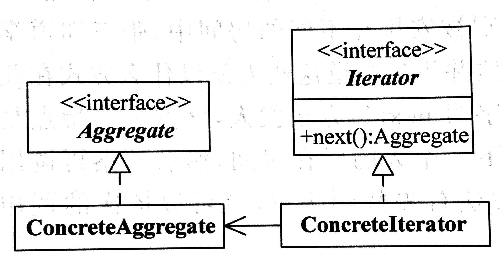

# 迭代器模式（iterator）

## 定义
提供一种方法顺序访问一个聚合对象中的各个元素，而又不需要暴露该对象的内部表示。

## 角色
集合(Aggregate)
具体集合(Concrete Aggregate)
迭代器(Iterator)
具体迭代器(Concrete Iterator)

## 优点
它支持以不同的方式遍历一个聚合对象。
迭代器简化了聚合类。
在同一个聚合上可以有多个遍历。
在迭代器模式中，增加新的聚合类和迭代器 类都很方便，无须修改原有代码，满足“开闭原则”的要求。

## 适用环境

访问一个聚合对象的内容而无须暴露它的内部表示。
需要为聚合对象提供多种遍历方式。
为遍历不同的聚合结构提供一个统一的接口。

## UML

