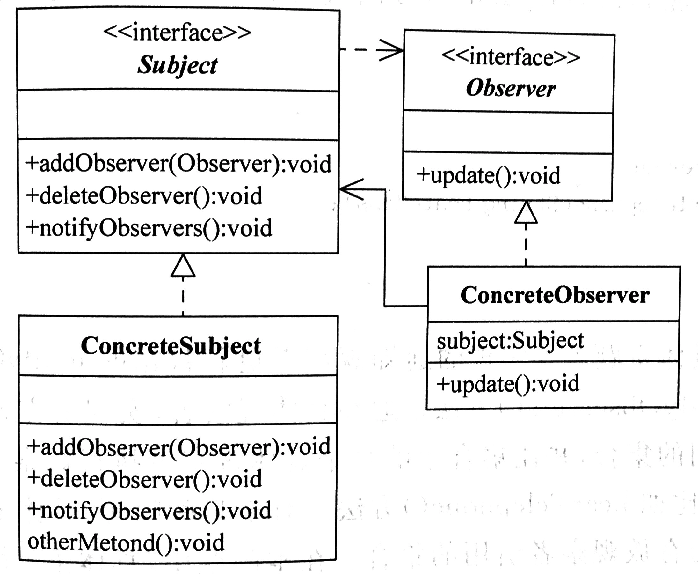

# 观察者模式（Observer)

## 定义

定义对象间的一种一对多的依赖关系，当一个对象的状态发生改变时，所有依赖它的对象都得到通知并被自动更新。

## 角色

主题(Subject)

观察者(Observer)

具体主题(Concrete Subject)

具体观察者(Concrete Observer)

## 优点

观察者模式可以实现表示层和数据逻辑层的分离，并定义 了稳定的消息更新传递机制，抽象了更新接口，使得可以 有各种各样不同的表示层作为具体观察者角色。

观察者模式在观察目标和观察者之间建立一个抽象的耦合。

观察者模式支持广播通信。

观察者模式符合“开闭原则”的要求。

## 适用环境

一个抽象模型有两个方面，其中一个方面依赖于另一个方 面。将这些方面封装在独立的对象中使它们可以各自独立 地改变和复用。

一个对象的改变将导致其他一个或多个对象也发生改变， 而不知道具体有多少对象将发生改变，可以降低对象之间的耦合度。

一个对象必须通知其他对象，而并不知道这些对象是谁。

需要在系统中创建一个触发链，A对象的行为将影响B对 象，B对象的行为将影响C对象……，可以使用观察者模 式创建一种链式触发机制。

## UML

