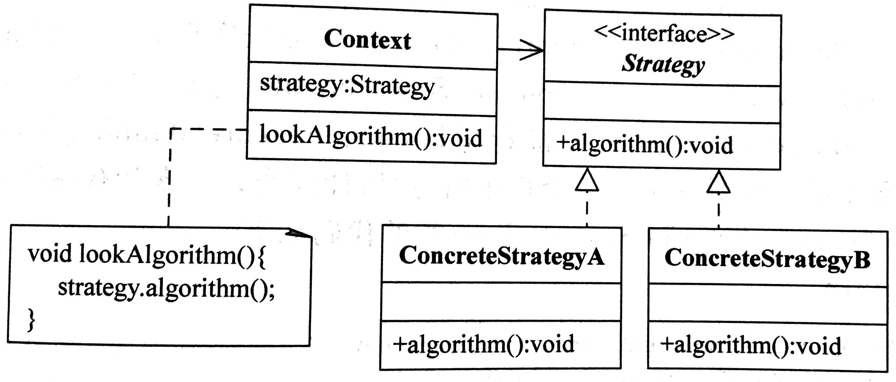

# 策略模式（Strategy）
 
## 定义

定义一系列算法，把它们一个个封装起来，并且使它们可相互替换。本模式使得算法可独立于使用它的客户而变化。

## 角色

- 策略 (Strategy)

- 具体策略(Concrete Strategy)

- 上下文(Context)

## 优点

1. 策略模式提供了对“开闭原则”的完美支持，用户可以在 不修改原有系统的基础上选择算法或行为，也可以灵活地 增加新的算法或行为。

2. 策略模式提供了管理相关的算法族的办法。

3. 策略模式提供了可以替换继承关系的办法。

4. 使用策略模式可以避免使用多重条件转移语句。

## 适用环境

1. 如果在一个系统里面有许多类，它们之间的区别仅在于它们的行为，那么使用策略模式可以动态地让一个对象在许 多行为中选择一种行为。

2. 一个系统需要动态地在几种算法中选择一种。

3. 如果一个对象有很多的行为，如果不用恰当的模式，这些行为就只好使用多重的条件选择语句来实现。

4. 不希望客户端知道复杂的、与算法相关的数据结构，在具体策略类中封装算法和相关的数据结构，提高算法的保密性与安全性。

## UML
